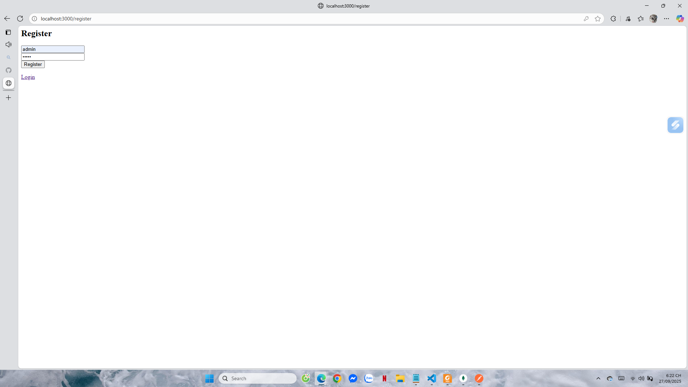
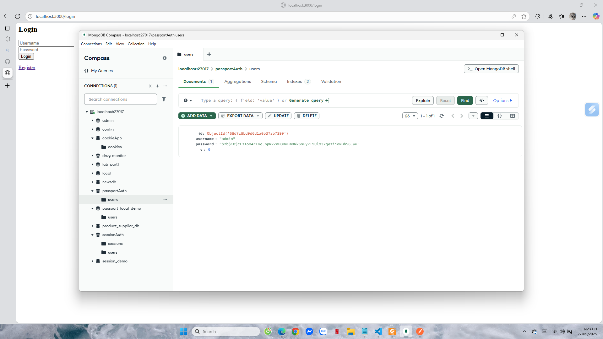
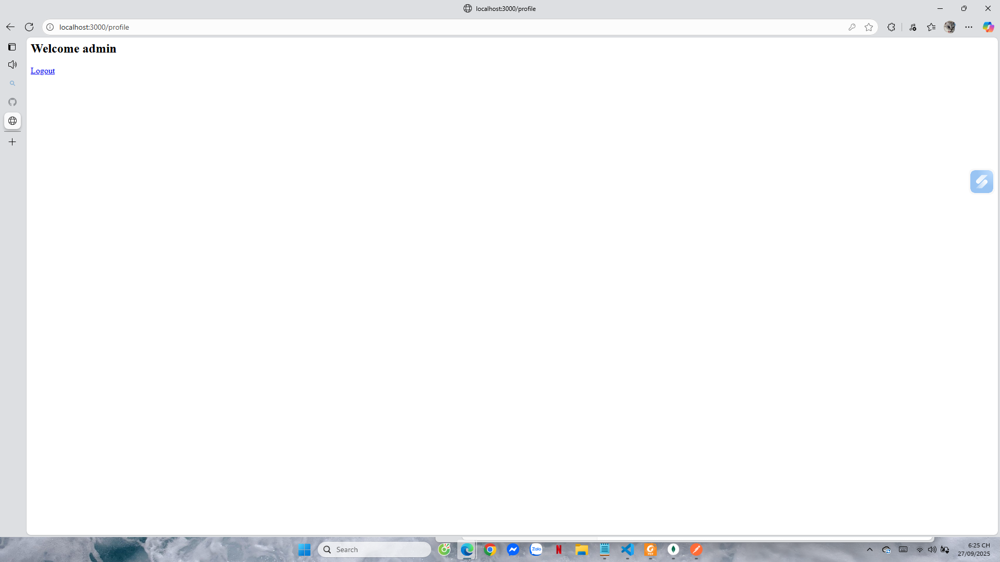
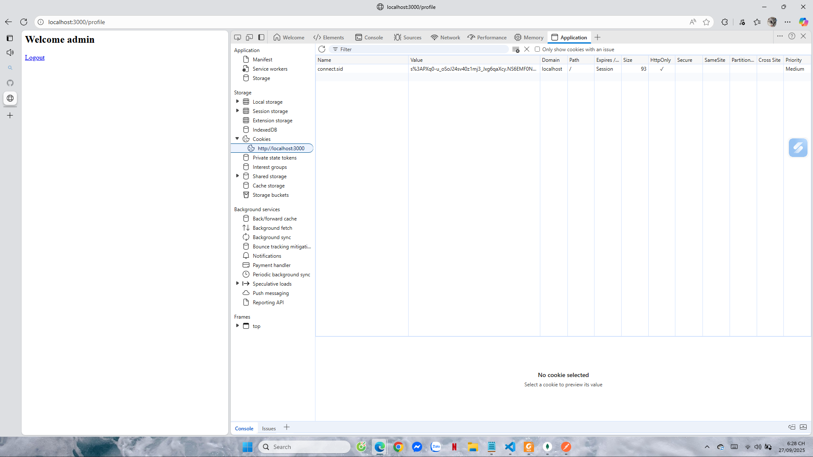
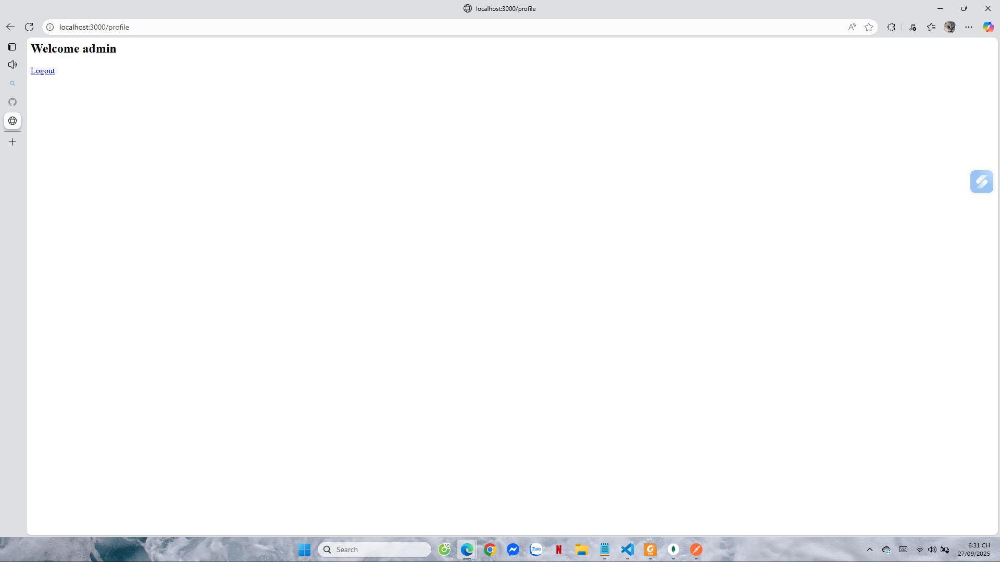
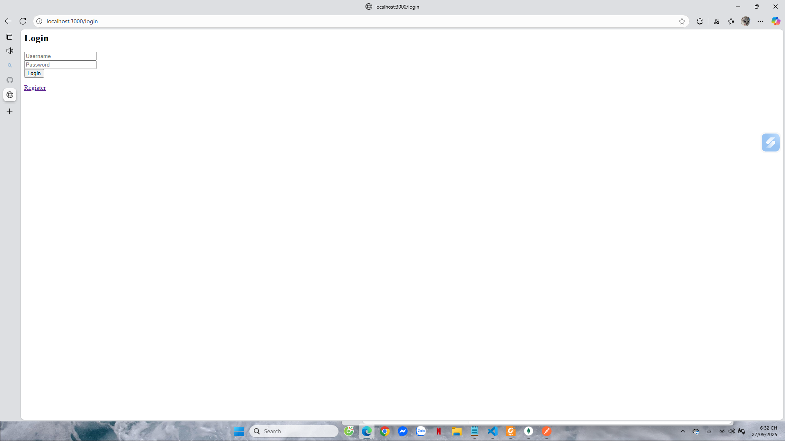
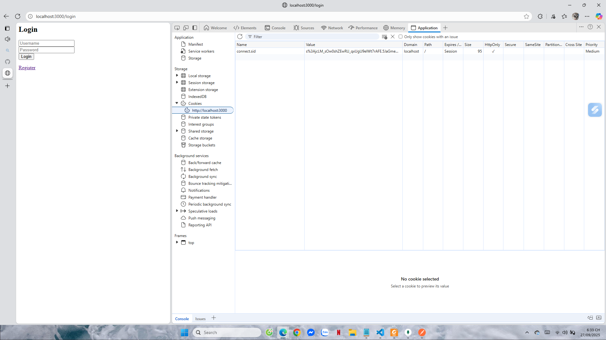

# Project 4: Local Passport Website

## Cách chạy
Cài đặt dependencies:
```bash
npm install
node app.js
```

Server chạy tại: http://localhost:3000  
Database: passport_local_demo (MongoDB)  

---

## 1. Register
- Mở trang http://localhost:3000/register
- Điền username/password và submit

Kết quả test
- User mới được tạo trong DB

Ảnh test:  
  
  

---

## 2. Login
- Mở trang http://localhost:3000/login
- Nhập username/password và submit

Kết quả test
- Sai → ở lại trang login (nếu có thông báo sẽ hiển thị, nếu không vẫn chỉ ở form login)
- Đúng → chuyển hướng vào trang profile

Ảnh test:  
  
  

Cookie connect.sid được lưu ở DevTools → Application → Cookies.

---

## 3. Profile (Protected page)
- Mở http://localhost:3000/profile

Kết quả test
- Chưa login → redirect về trang login (không hiển thị thông báo 401, mà chuyển thẳng về form login)  


- Đã login → hiển thị "Welcome admin"  


---

## 4. Logout
- Mở http://localhost:3000/logout

Kết quả test
- Response: trang logout thành công  


- Trong DevTools → Cookie connect.sid vẫn còn  


Giải thích  
Khi gọi `req.logout()`, Passport chỉ hủy session server-side. Cookie client-side (connect.sid) không bị xóa tự động. Vì vậy cookie vẫn hiển thị trong DevTools, nhưng đã trở nên vô hiệu. Nếu thử truy cập lại /profile sẽ bị redirect về login. Đây là hành vi chuẩn của Passport Local.

---

## Hoàn thành
- app.js → cấu hình server, session, Passport Local
- routes/auth.js → xử lý register, login, profile, logout
- Test đầy đủ các trường hợp:
  - Register thành công
  - Login thành công + cookie session
  - Profile: chưa login → redirect, đã login → vào profile
  - Logout: session invalid (cookie vẫn còn nhưng không hợp lệ)

Ảnh minh họa test: nằm trong thư mục public/results/
